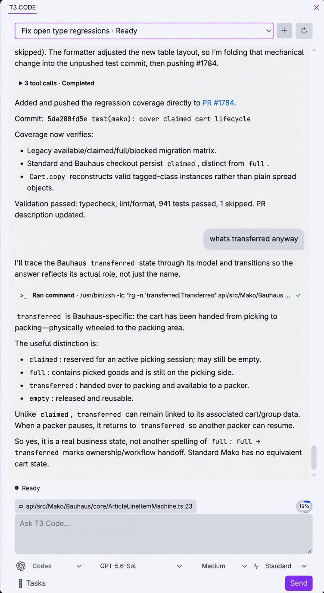

# T3 Code for VS Code



> **Unofficial fork build.** This extension is published as `patroza.t3-code` from
> [patroza/t3code](https://github.com/patroza/t3code), a fork of
> [pingdotgg/t3code](https://github.com/pingdotgg/t3code). It is not published or supported by
> T3 Tools Inc. Report issues against
> [this fork's tracker](https://github.com/patroza/t3code/issues).

This package exposes T3 Code as a dedicated VS Code secondary-sidebar chat tab, alongside the
Claude Code, Chat, and Codex tabs. It connects directly to the same T3 Code server used by the web,
desktop, and mobile clients, so projects, threads, messages, turn state, and assistant streaming
remain synchronized. It also provides an optional native `@t3` participant inside VS Code Chat.

## Requirements

The extension is a client only — it needs a T3 Code backend to talk to. Either run T3 Desktop on the
same machine as the extension host, or point `t3Code.serverUrl` at a reachable T3 Code server.
VS Code 1.95 or newer is required.

## Connecting to a server

**The default is `http://127.0.0.1:3773`**, which is a T3 Code server running on your own machine.
If that describes your setup, there is nothing to configure. Change the URL if your server runs on
another host or a different port.

Run **T3 Code: Set Server URL** from the Command Palette to change it. The prompt is prefilled with
the current value and rejects anything that isn't an `http`/`https` URL, so a typo surfaces
immediately instead of as a failed connection later. The extension reconnects as soon as the
setting changes.

If the server requires authentication, run **T3 Code: Set Server Bearer Token**. The token is kept
in VS Code's secret storage — never in your settings file — and is exchanged for a short-lived
WebSocket ticket.

Two details worth knowing:

- **A local T3 Desktop runtime wins over this setting.** The extension prefers the backend
  advertised by the T3 Desktop process beside its extension host, and only falls back to
  `t3Code.serverUrl`. This is what makes local, SSH, and other remote windows work independently,
  rather than treating a synced `127.0.0.1` setting as the same machine.
- **`t3Code.serverUrl` is machine-scoped.** It is stored per machine in your user settings and
  cannot be set per workspace, so a `127.0.0.1` URL never follows you to a different machine.

Connection trouble is usually quickest to diagnose from **T3 Code: Show Diagnostics**, which logs
each endpoint the extension tried and why it was rejected.

## Settings

Run **T3 Code: Open Settings** to open all of these in the Settings UI, or edit `settings.json`
directly.

| Setting                            | Default                 | What it does                                                                                                                                 |
| ---------------------------------- | ----------------------- | -------------------------------------------------------------------------------------------------------------------------------------------- |
| `t3Code.serverUrl`                 | `http://127.0.0.1:3773` | Fallback server URL, used when no local T3 Desktop runtime is advertised. WebSocket and environment endpoints are derived from it.           |
| `t3Code.defaultRuntimeMode`        | `full-access`           | Runtime mode for new threads: `approval-required`, `auto-accept-edits`, or `full-access`.                                                    |
| `t3Code.desktopClientSettingsPath` | `""` (auto-detect)      | Path to T3 Desktop's `client-settings.json`, to share provider and model favorites. Auto-detects `~/.t3/userdata` or `~/.t3/dev` when empty. |

The default runtime mode is `full-access`, meaning new threads apply edits and run commands without
asking. Set `t3Code.defaultRuntimeMode` to `approval-required` if you would rather review each one.

## Development

1. Start T3 Code (`pnpm dev`), which listens at `http://127.0.0.1:3773` by default.
2. Build the extension with `pnpm --filter t3-code build`.
3. Open this repository in VS Code, choose **Run Extension** from the Run and Debug view, and point
   the extension-development host at `apps/vscode` if prompted.
4. Select the **T3 Code** tab in the secondary sidebar. Use **T3 Code: Open Chat** from the Command
   Palette if the secondary sidebar is hidden.

## Dedicated chat workflow

The T3 Code tab contains a worktree-scoped thread picker, synchronized transcript, context control,
and prompt composer. Select a thread to continue it on any T3 client, or use **+** to create one for
the open worktree. Enter sends; Shift+Enter inserts a newline.

The same operations are also available through the optional native Chat participant:

- `@t3 /threads` selects an existing thread whose worktree matches the open workspace folder.
- `@t3 /new` creates a synchronized thread (and a project when the folder is not registered yet).
- A normal `@t3` prompt continues the last selected thread, or the most recently updated matching
  thread. If none exists, it creates one.
- `@t3 /history`, `/status`, and `/stop` inspect or control the selected server thread.

Active editor context is included by default and can be toggled from the composer, with
`@t3 /context`, or **T3 Code: Toggle Automatic Editor Context**. This preference is kept in VS Code's
extension state and never written to workspace settings. A non-empty
selection includes the exact character range; an empty selection includes the cursor line and
column. Explicit Chat references such as `#file` and attached selections are always included.

The **T3 Code: Ask About Selection** editor action opens Chat with `@t3` prefilled. Context is sent
as structured-looking provider context using workspace-relative paths and language-aware Markdown
fences. T3 Code clients present that envelope as a context reference rather than authored text.

## Releasing

The extension publishes to the `patroza` namespace on both the VS Code Marketplace and Open VSX.
Extension IDs and versions are shared between the two, so publish the same `.vsix` to each.

Bump `version` in `apps/vscode/package.json`, add a `CHANGELOG.md` entry, then commit and **push** —
packaging pins README links to the current commit and refuses to run if that commit is not on a
remote branch. Then:

```sh
pnpm --filter t3-code package                 # -> t3-code-<version>.vsix
```

Both `package` and `publish:vsce` go through `scripts/vsce.ts`, which runs the `vscode:prepublish`
build and supplies two sets of flags:

- `--no-dependencies`, because esbuild already bundles `src/`. Nothing from `node_modules` ships,
  and vsce never has to resolve the `workspace:*` dependencies it cannot understand.
- `--baseContentUrl` / `--baseImagesUrl` pinned to the current commit, because vsce cannot infer
  that this extension lives in a monorepo subdirectory and would otherwise rewrite the README's
  relative links to the repository root. Pinning to the commit rather than `main` keeps each
  published version's README pointing at the tree it was built from, so the screenshot survives
  files moving later and works even when a version is published before its commit reaches `main`.
  A published README cannot be corrected without publishing a new version.

Inspect the packaged contents before publishing:

```sh
pnpm --filter t3-code exec vsce ls --no-dependencies
```

Publishing needs a token per registry, neither of which is stored in this repo:

- **Marketplace** — an Azure DevOps PAT for the `patroza` publisher, created with the **Marketplace:
  Manage** scope and the organization set to **All accessible organizations** (a PAT scoped to a
  single organization fails at publish time with a 401). Pass it as `VSCE_PAT`, or run
  `vsce login patroza` once. Note that Azure DevOps retires global PATs on **December 1, 2026**; the
  replacement, `vsce publish --azure-credential` backed by Microsoft Entra ID, currently only covers
  CI pipelines, so manual publishing still depends on a PAT until then.
- **Open VSX** — an access token for the `patroza` namespace from <https://open-vsx.org/user-settings/tokens>.
  Pass it as `OVSX_PAT`. The namespace must be created once with `ovsx create-namespace patroza`.

```sh
VSCE_PAT=... pnpm --filter t3-code publish:vsce
OVSX_PAT=... pnpm --filter t3-code publish:ovsx t3-code-<version>.vsix
```

Tag the release as `vscode-v<version>` so extension tags do not collide with the `v*.*.*` tags that
drive the desktop release workflow.
